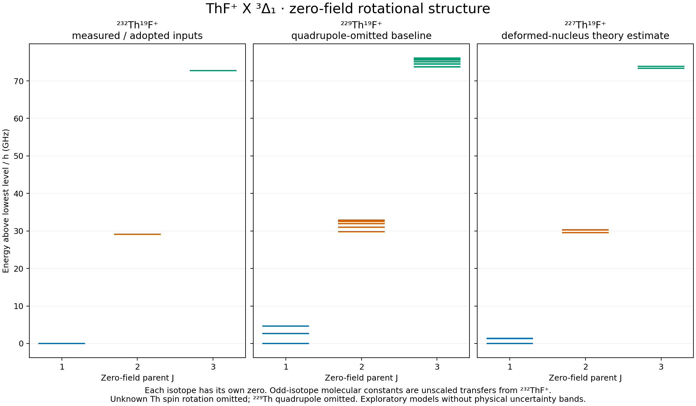

# heff: molecular effective Hamiltonians

`heff` calculates molecular energy levels and their response to electric and
magnetic fields. In the [232ThF+ tutorial](notebooks/ThF_plus_X3Delta1_Tutorial.ipynb),
we build the basis, add the interactions, and follow how each term changes the
spectrum. You can run the notebook, vary the fields, and inspect the states.

We write the effective Hamiltonian as

```text
H/h = sum_k c_k M_k       (frequencies in MHz)
```

Each matrix `M_k` describes one interaction in the chosen basis. Its coefficient
`c_k` contains the molecular parameters or field strengths. A field sweep
therefore reuses the angular-momentum algebra. Changing the basis or operator
model requires new matrices.

## Start here

1. Install using Python 3.12 or newer:

   ```shell
   git clone https://github.com/arianjad/heff.git
   cd heff
   python -m pip install -e ".[notebooks,test]"
   ```

   For an isolated virtual environment and platform-specific activation steps,
   see [getting started](docs/getting-started.md#1-clone-and-install).

2. Calculate the 232ThF+ spectrum:

   ```python
   import numpy as np
   from heff import load_model

   model = load_model("thf_plus")
   problem = model.problem(J_max=3)
   H = problem.hamiltonian(E_z=20.0, B_z=0.01)
   energies, states = np.linalg.eigh(H)

   print(H.shape)  # (60, 60)
   print(energies[:6] - energies[0])  # MHz above the lowest level
   ```

   Fields are in V/cm and gauss. Columns of `states` are eigenvectors in
   `problem.kets`. Increase the cutoff to check convergence for your calculation.

3. Plot [your first field sweep](docs/getting-started.md#3-plot-a-stark-sweep),
   then open [the 232ThF+ tutorial on GitHub](https://github.com/arianjad/heff/blob/main/notebooks/ThF_plus_X3Delta1_Tutorial.ipynb).
   Run `python -m jupyterlab` from this environment to work through it.

4. Check the assumptions in [models and units](docs/models.md) before comparing
   to a measurement. Inspect `model.describe()` for parameter sources and status.

## What is available

| Model | What you can calculate | Physical scope |
|---|---|---|
| 232Th19F+ X 3Delta1 | Rotation, hyperfine/parity structure, Stark/Zeeman shifts, E1 transitions, selected observables | Effective Omega=±1 manifold; measured and adopted inputs with stated approximations |
| 229Th19F+ and 227Th19F+ | Two coupled nuclear spins, Th hyperfine, applicable quadrupole operators, field shifts | Exploratory isotope models; several inputs are transferred estimates or placeholders |
| Equivalent-proton amides | Asymmetric rotation, electron/nuclear spin interactions, exchange-filtered proton pair, optional metal spin | Restricted `amide_c2v` backend; the provided coefficients are synthetic |

Select an isotope with
`load_model("thf_plus", isotope="229Th19F")`, or load a custom TOML file with
`load_model("examples/models/amide_synthetic.toml")`. See
[the model guide](docs/models.md) for coupling order, supported terms, and units.
Each TOML file selects a basis and interactions that its backend implements.

The lower-level API also exposes E1 line strengths and rank-0/rank-2 effective
two-photon operators. Their validity conditions and parameter limitations are
explained in [the isotope tutorial](notebooks/ThF_plus_Isotopologues.ipynb).
Numerical diagonalization currently uses NumPy/SciPy on the CPU.

## Worked isotope figures

[Open the level, Stark, and Zeeman figure set](results/thf-fields-2026-09-08/thf-isotopes-levels-stark-zeeman.pdf):
J=1–3, electric fields to 10 kV/cm, and magnetic fields to 100 G.



The [figure notes and data](results/thf-fields-2026-09-08/README.md) give the
inputs, state labels, and basis-convergence checks. The plotting parameters
differ from the bundled defaults:

- The 229Th baseline omits unknown quadrupoles; an extra page shows an
  unvalidated sensitivity case.
- The 227Th plots use a deformed-nucleus theory estimate. The bundled 227Th
  model and advanced notebook retain the much larger Schmidt stress-test value.

## Before interpreting a result

A smooth, converged spectrum can still depend on an unknown molecular constant.
Several odd-isotope inputs are estimates or placeholders. Check their sources
and status, then test the rotational cutoff for the states and fields you study.
At crossings, also check whether a curve follows energy order or eigenstate
character. The [scientific limitations](docs/open-questions.md) and
[Hamiltonian reference](docs/thf-plus-x3delta1-effective-hamiltonian.md) explain
the approximations and conventions.

## Tests and repository map

```shell
python -m pytest -q
```

Run the tests when checking an installation or changing code; calculations do
not run them automatically. The suite checks assembly, symmetries, analytic
limits, parameter metadata, and model loading. Two literature comparisons are
opt-in; commands are in [contributing](docs/contributing.md).

| Directory | Purpose |
|---|---|
| `heff/` | Python implementation and bundled model data |
| `examples/` and `notebooks/` | Runnable models and teaching material |
| `docs/` | Current guides, physics references, and supporting source records |
| `results/` | Reproducible figures, parameter records, and numerical data |
| `tests/` and `scripts/` | Checks, plot reproduction, and local student packaging |

Use the [documentation index](docs/README.md) for the learning path and the
[architecture guide](docs/architecture.md) to navigate the implementation.
To create a clean local copy to share with students, run
`python scripts/package_students.py`; see [what it includes](docs/contributing.md#build-a-local-wheel-or-student-archive).
