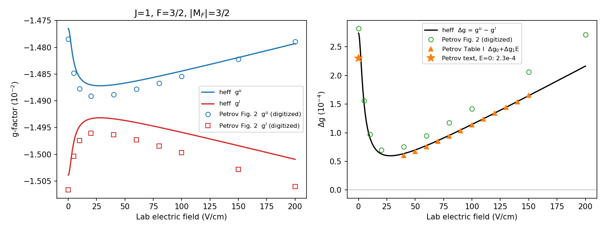

# ThF⁺ J=1, F=3/2 g-factors versus electric field, against Petrov & Skripnikov 2025

`heff` with the three-parameter Zeeman tensor (`docs/lit/lookup-effective-zeeman-tensor.md`)
compared with Petrov & Skripnikov, PRA 111, 062822 (2025), arXiv:2503.02840, Fig. 2 and
Table I. Produced by `scripts/plot_thf_zeeman_vs_petrov.py`; J ≤ 4 basis, ²³²ThF⁺ default
parameters, |M_F| = 3/2 block, upper and lower doublet components identified by energy.

## Files

- `heff_vs_petrov_fig2.csv`: E (V/cm), g^u, g^l, Δg = g^u − g^l, and the two level energies (MHz).
- `petrov2025-fig2-digitized.csv`: Petrov's Fig. 2 curves read from the rendered figure
  at ten field values; reading precision about 3 × 10⁻⁵ in g, so the digitized Δg carries
  about 20 % scatter.

## Comparison

| quantity | heff | Petrov 2025 |
|---|---|---|
| Δg at E = 0, F = 3/2 | +2.74 × 10⁻⁴ | +2.3 × 10⁻⁴ (text, §IV); ≈ +2.8 × 10⁻⁴ read from Fig. 2 |
| Δg at 60 V/cm | +7.77 × 10⁻⁵ | +7.56 × 10⁻⁵ (Table I, Δg₀ + Δg₁E) |
| minimum \|Δg\| | 6.0 × 10⁻⁵ at 28 V/cm | ≈ 6.8 × 10⁻⁵ near 24 V/cm (Fig. 2) |
| Δg at 40…150 V/cm vs Table I | ratio 1.06 → 1.00 | |

Nothing in the tensor was fitted to Table I or to Fig. 2: G_zz is anchored to Ng's
|g(J=1, F=3/2)| = 0.0149, and G_xx, G_yy come from Petrov's published matrix elements
through second-order perturbation theory. The zero-field Δg is the second-order value,
19 % above the number Petrov prints in the text and within the reading precision of his
figure. The field dependence is the Stark J-mixing mechanism (Leanhardt 2011 Eq. 66)
acting on the parity-split intercept.

The mean g-factor ḡ(E) drifts about 3 × 10⁻⁵ less than Petrov's curves by 200 V/cm
(0.2 % of g). That is the single-electronic-state limitation recorded in
`docs/thf-plus-x3delta1-effective-hamiltonian.md` §1.2: the ³Δ₂ admixture is not in the
basis, and the same limitation gives δg/g at 60 V/cm 15 % below Ng's measurement.

Sign: Δg > 0 means the upper doublet component has the smaller |g|. This follows from
the e level (parity +(−1)^J) lying below f and carrying the larger |g|, the ordering of
Petrov's model that `heff` adopts (`docs/lit/lookup-effective-zeeman-tensor.md` §1.2).
